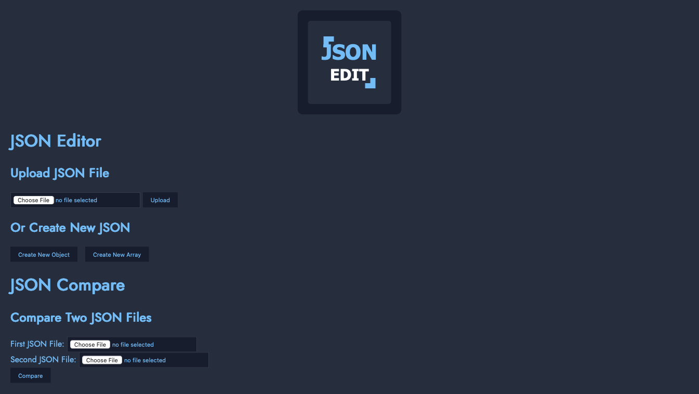
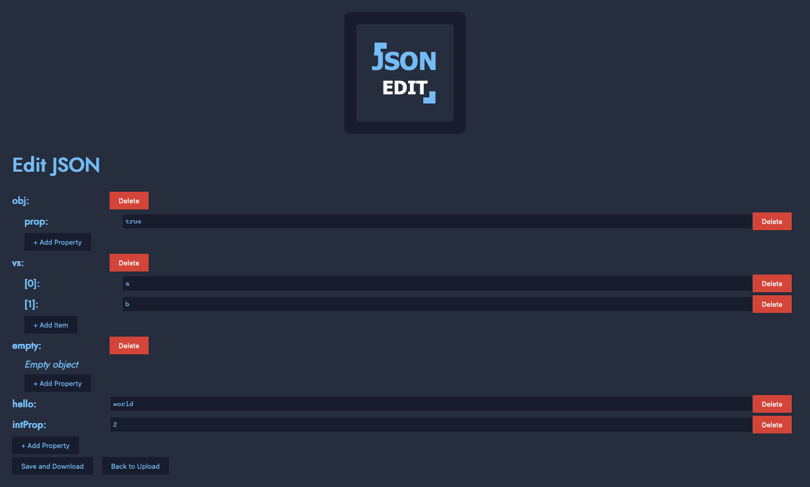
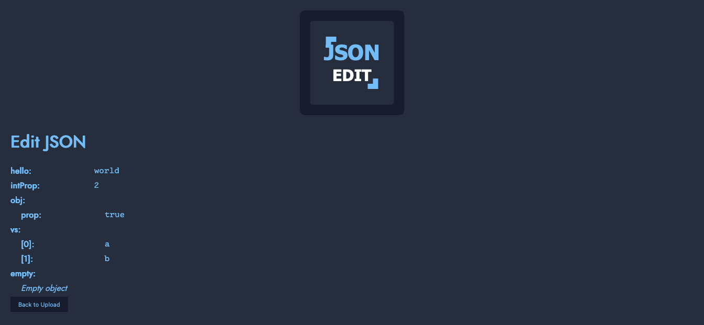
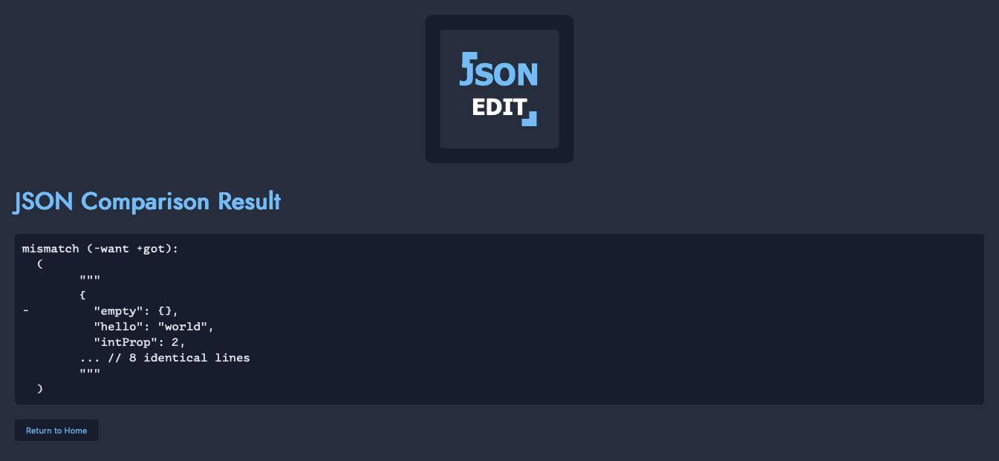

# JSON Edit

<p align="center">
  
</p>

A web-based JSON editor application.

## Features

- Edit JSON files via a web interface
- Compare JSON files
- Read-only mode option
- Configurable indentation

## Show me

### Home Page
The landing page of the application provides quick access to all main features. From here, you can:
- Create a new JSON document
- Open an existing JSON file
- Access the comparison tool



### JSON Editor
A full-featured JSON editor with syntax highlighting and validation. This view allows you to:
- Edit JSON content
- Save changes to files



### JSON Viewer
A read-only view for JSON documents with collapsible sections. This view is ideal for:
- Reviewing JSON data without risk of accidental changes



### JSON Comparison
A comparison tool that highlights differences between two JSON documents. Features include:
- Visual highlighting of added, modified, and removed elements



### Debug Visualizer
An advanced debugging tool available in debug mode that shows:
- HTTP request and response details
- Application logs and events
- Performance metrics
- Request tracing information


Call it at /__viz

## Usage

```bash
# Run with default settings
jsonedit

# Run with custom settings
jsonedit --port 3000 --host 0.0.0.0 --indent "    " --read-only
```

## Configuration

The application can be configured using command-line flags or environment variables:

| Flag | Environment Variable | Default | Description |
|------|---------------------|---------|-------------|
| `--port` | `JSON_EDIT_PORT` | 8080 | Port to listen on |
| `--host` | `JSON_EDIT_HOST` | localhost | Host to listen on |
| `--indent` | `JSON_EDIT_INDENT` | "  " | Indentation level |
| `--read-only` | `JSON_EDIT_READ_ONLY` | false | Read-only mode |
| `--log-level` | `JSON_EDIT_LOG_LEVEL` | info | Log level (debug, info, warn, error) |

When running in debug mode (by setting `--log-level debug`), the application exposes a `/__viz` endpoint that provides visualization and logging of HTTP requests and responses, which is useful for debugging and development.

## Building and Releasing

This project uses [GoReleaser](https://goreleaser.com/) to build and release binaries for multiple platforms:

- macOS (arm64, amd64)
- Linux (arm64, amd64)
- Windows (amd64)

### Local Testing

To test the build process locally:

```bash
# Install GoReleaser if you haven't already
go install github.com/goreleaser/goreleaser@latest

# Test the build without releasing
goreleaser build --snapshot --clean
```

The built binaries will be available in the `dist/` directory.

### Creating a Release

To create a new release:

1. Tag the commit you want to release:
   ```bash
   git tag -a v0.1.0 -m "First release"
   git push origin v0.1.0
   ```

2. The GitHub Actions workflow will automatically build and release the binaries.

3. The release will be available on the GitHub Releases page.

## Used dependencies

### Go dependencies

This project uses the following dependencies not from the same author:

- [github.com/doganarif/govisual](https://github.com/doganarif/govisual) - Visual debugging tool
- [github.com/google/go-cmp](https://github.com/google/go-cmp) - Package for comparing Go values
- [github.com/google/gops](https://github.com/google/gops) - Tool to list and diagnose Go processes

### Used Fonts

This project uses the following fonts:
- [Monaspace](https://github.com/githubnext/monaspace) - Used for monospaced text
- [Jost](https://github.com/indestructible-type/Jost) - Used for non-monospaced text

## License

This project is licensed under the [Apache License 2.0](LICENSE) - see the [LICENSE](LICENSE) file for details.
